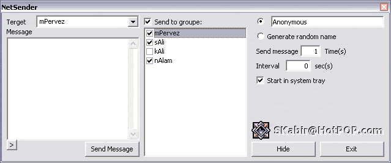



## A   Network Messaging Program\- NetSender

### Description

Hide your name in the message and they wonders 'Who sent me this POPUP!!!'. Sends message across the LANed PCs. Send messages fast and to group of users together.
 
### More Info
 
Not known!

             |
---                |---
**Submitted On**   |2002-10-30 18:21:08
**By**             |[Broken Arrow](https://github.com/Planet-Source-Code/PSCIndex/blob/master/ByAuthor/broken-arrow.md)
**Level**          |Intermediate
**User Rating**    |4.9 (34 globes from 7 users)
**Compatibility**  |VB 4\.0 \(32\-bit\), VB 5\.0, VB 6\.0
**Category**       |[Complete Applications](https://github.com/Planet-Source-Code/PSCIndex/blob/master/ByCategory/complete-applications__1-27.md)
**World**          |[Visual Basic](https://github.com/Planet-Source-Code/PSCIndex/blob/master/ByWorld/visual-basic.md)
**Archive File**   |[A\_\_\_Networ15032911252002\.zip](https://github.com/Planet-Source-Code/broken-arrow-a-network-messaging-program-netsender__1-40539/archive/master.zip)

